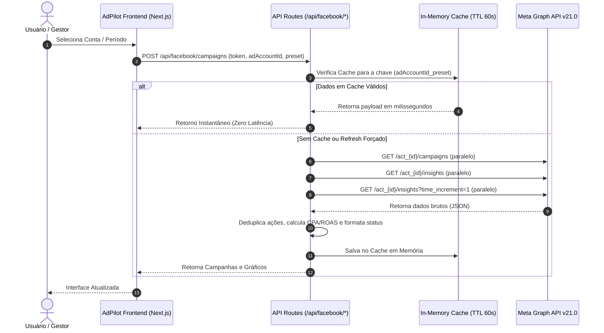

# 📘 Arquitetura de Integração com o Facebook Ads (Meta Graph API v21.0)

Este documento detalha **tudo o que o AdPilot puxa**, **como é puxado via Token de Acesso** e **como os dados são tratados, enriquecidos e apresentados** na aplicação.

---

## 📑 Sumário
1. [Autenticação e Permissões do Token](#1-autenticação-e-permissões-do-token)
2. [Fluxo e Ciclo de Vida da Requisição](#2-fluxo-e-ciclo-de-vida-da-requisição)
3. [Endpoints da Graph API Consumidos](#3-endpoints-da-graph-api-consumidos)
4. [Tudo o Que é Extraído (Campos e Métricas)](#4-tudo-o-que-é-extraído-campos-e-métricas)
5. [Motor de Normalização e Deduplicação de Conversões](#5-motor-de-normalização-e-deduplicação-de-conversões)
6. [Resolução de Mídias e Vídeos (MP4)](#6-resolução-de-mídias-e-vídeos-mp4)
7. [Algoritmo de Fadiga de Criativos e Badges](#7-algoritmo-de-fadiga-de-criativos-e-badges)
8. [Automações Ativas (Stop-Loss do Guardião)](#8-automações-ativas-stop-loss-do-guardião)
9. [Estratégia de Performance (Cache em Memória e Paginação)](#9-estratégia-de-performance-cache-em-memória-e-paginação)

---

## 1. Autenticação e Permissões do Token

A comunicação com os servidores da Meta é realizada através da **Meta Graph API v21.0** (`https://graph.facebook.com/v21.0`).

### Tipos de Token Suportados:
- **User Access Token (Token de Usuário):** Gerado via Meta for Developers ou Graph API Explorer.
- **System User Token (Usuário do Sistema no Business Manager):** Token de longa duração (permanente), recomendado para operação em produção da agência.
- **Fallback Multinível:**
  1. Token passado pelo cliente via requisição (localStorage/sessão do usuário).
  2. Token individual salvo no banco (`prisma.userSettings.fbAccessToken`).
  3. Token global da agência cadastrado pelo Administrador (`prisma.globalSetting.fbAccessToken`).
  4. Variável de ambiente do servidor (`ADMIN_FACEBOOK_ACCESS_TOKEN`).

### Permissões Necessárias (Scopes):
- `ads_read`: Permite ler campanhas, conjuntos, anúncios e criativos.
- `read_insights`: Permite extrair métricas financeiras, conversões, cliques e impressões.
- `ads_management`: *(Opcional)* Necessária caso o usuário utilize o **Guardião** para pausar automaticamente anúncios com Stop-Loss.

---

## 2. Fluxo e Ciclo de Vida da Requisição

---

## 3. Endpoints da Graph API Consumidos

| Endpoint Meta | Finalidade | Módulo AdPilot |
| :--- | :--- | :--- |
| `GET /me/adaccounts` | Lista todas as contas de anúncio com permissão de acesso | Seletor de Contas / Configurações |
| `GET /act_{id}` | Validação de credenciais e status da conta | Validador de Chaves |
| `GET /act_{id}/campaigns` | Lista campanhas ativas, pausadas e arquivadas | Dashboard & Campanhas |
| `GET /act_{id}/insights` | Métricas agregadas da conta por campanha | KPIs, Tabela e ROAS |
| `GET /act_{id}/insights?time_increment=1` | Métricas diárias para gráficos temporais | Gráfico de Evolução |
| `GET /act_{id}/adsets` | Conjuntos de anúncios, lances e metas de otimização | Detalhamento de AdSets |
| `GET /act_{id}/ads` | Anúncios, criativos e IDs de vídeo | Galeria de Criativos & Guardião |
| `GET /{video_id}?fields=source,picture` | Resolução do arquivo `.mp4` para reprodução | Player de Vídeo dos Criativos |
| `POST /{ad_id}` | Atualização de status (`PAUSED` ou `ACTIVE`) | Ações Automáticas do Guardião |

---

## 4. Tudo o Que é Extraído (Campos e Métricas)

### A. Dados Estruturais da Conta
- **ID da Conta:** Normalizado automaticamente com prefixo `act_` caso o usuário não informe.
- **Nome da Conta:** Ex: `Loja Virtual XYZ`.
- **Moeda:** BRL (R$), USD ($), EUR (€), etc.
- **Status da Conta:** Ativa (`1`), Desativada (`2`), etc.

### B. Nível de Campanhas
- **Identificação:** `id`, `name`.
- **Status:** Resolução inteligente combinando `status` com `effective_status`:
  - `ACTIVE`: Em veiculação, em análise ou agendada.
  - `PAUSED`: Pausada manualmente ou por conjunto.
  - `ARCHIVED`: Arquivada ou deletada.
- **Objetivo da Campanha:** `objective` (ex: `OUTCOME_SALES`, `OUTCOME_LEADS`, `OUTCOME_TRAFFIC`, etc.).
- **Orçamentos:** `daily_budget` (dividido por 100 para converter de centavos) e `lifetime_budget`.
- **Datas:** Data de início (`start_time`/`created_time`) e data de encerramento (`stop_time`).

### C. Nível de Criativos e Anúncios
- **Textos e Copies:** Título do anúncio (`title`), texto principal/legenda (`body`).
- **Imagens:** Imagem de alta resolução (`image_url`), thumbnail (`thumbnail_url`) e imagens extraídas de `object_story_spec`.
- **Vídeos:** Identificador do vídeo (`video_id`), thumbnail do frame e URL do vídeo MP4 gerada diretamente pelo Facebook CDN.

### D. Métricas Financeiras e de Performance
- **Investimento:** `spend` (valor financeiro gasto no período).
- **Impressões e Alcance:** `impressions`, `reach`.
- **Frequência:** Quantidade média de vezes que o mesmo usuário viu o anúncio (`frequency` ou `impressions / reach`).
- **Cliques e Taxas:** `clicks`, `ctr` (Taxa de Cliques %), `cpc` (Custo por Clique), `cpm` (Custo por Mil Impressões).
- **Receita Gerada:** Extraída de `action_values` com base nos valores atribuídos pelo Pixel da Meta (`purchase_value`).
- **ROAS (Retorno sobre Investimento Publicitário):** `Receita Total / Investimento Total`.

---

## 5. Motor de Normalização e Deduplicação de Conversões

O Meta Ads costuma registrar múltiplos tipos de evento dentro do array `actions` para a mesma conversão (ex: `omni_purchase` e `offsite_conversion.fb_pixel_purchase`). Se somados diretamente, os dados ficam inflados. O AdPilot possui funções especializadas para evitar duplicidade:

### 1. Vendas / Compras no Site (`extractPurchases`)
Busca prioritária e exclusiva na seguinte ordem:
1. `offsite_conversion.fb_pixel_purchase`
2. `purchase`
3. `omni_purchase`

### 2. Valor de Vendas / Faturamento (`extractPurchaseValue`)
Extraído de `action_values`:
1. `omni_purchase`
2. `offsite_conversion.fb_pixel_purchase`
3. `purchase`
4. `onsite_web_purchase`

### 3. Mensagens e Conversas Iniciadas no WhatsApp (`extractMessages`)
1. `onsite_conversion.messaging_conversation_started_7d`
2. `messaging_conversation_started_7d`
3. `messaging_user_initiated`

### 4. Captação de Leads (`extractLeads`)
1. `lead`
2. `offsite_conversion.fb_pixel_lead`
3. `onsite_conversion.lead_grouped`

### 5. Reconhecimento Automático de Resultados (`extractCampaignResults`)
Mapeia automaticamente o resultado principal da campanha de forma análoga à coluna **"Resultados"** do Gerenciador de Anúncios da Meta:
- Campanhas com vendas registradas $\rightarrow$ Rótulo: **"Vendas (Site)"**
- Campanhas de mensagens $\rightarrow$ Rótulo: **"Leads (WhatsApp)"**
- Formulários de cadastro $\rightarrow$ Rótulo: **"Leads"**

---

## 6. Resolução de Mídias e Vídeos (MP4)

Para alimentar o reprodutor de vídeo interativo do AdPilot:
1. O backend busca todos os anúncios com `creative{video_id}` ou `object_story_spec.video_data`.
2. O sistema faz um lote paralelo (`Promise.allSettled`) consultando `https://graph.facebook.com/v21.0/{video_id}?fields=source,picture`.
3. O campo `source` retorna o link direto do arquivo `.mp4` hospedado na infraestrutura da Meta com suporte a streaming contínuo.
4. O frontend carrega o vídeo no modal com controle de reprodução, volume, tela cheia e métricas integradas.

---

## 7. Algoritmo de Fadiga de Criativos e Badges

A rota `/api/facebook/creatives` calcula a saúde dos anúncios em tempo real:

### Análise Matemática de Fadiga:
- 🔴 **FADIGADO (Crítico):** Frequência $\ge 3.5\text{x}$ ou ($\text{Frequência} \ge 2.8\text{x}$ com $\text{CTR} < 1.0\%$ e gasto $> \text{R\$ } 100$).  
  *Diagnóstico:* Público saturado, perda de relevância e queima de orçamento.
- 🟡 **ATENÇÃO (Alerta):** Frequência $\ge 2.2\text{x}$ ou ($\text{Frequência} \ge 1.8\text{x}$ com $\text{CTR} < 1.4\%$).  
  *Diagnóstico:* Sinais iniciais de desgaste da audiência.
- 🟢 **SAUDÁVEL:** Frequência sob controle com CTR estável.

### Badges Dinâmicos Automáticos:
- 🥇 **#1 ROAS:** O criativo com maior retorno financeiro comprovado.
- 💎 **Mais Conversões:** O criativo com maior volume absoluto de compras/leads.
- 🔥 **Mais Cliques:** O criativo com melhor tração de tráfego.
- 🎯 **Menor CPA:** O anúncio mais econômico por resultado.

---

## 8. Automações Ativas (Stop-Loss do Guardião)

O motor do Guardião (`/api/facebook/guardian/scan`) cruza os anúncios reais da conta contra regras de proteção:

1. **Stop-Loss por Gasto sem Conversão:** Identifica anúncios que gastaram mais do que o limite definido (ex: R$ 50,00) sem gerar nenhuma venda ou lead.
2. **Teto de CPA:** Identifica anúncios cujo custo por resultado ultrapassou a margem aceitável.
3. **Fadiga de Público:** Detecta audiências saturadas.
4. **Escala de Campeões:** Sugere aumento orçamentário para criativos que atingem estabilidade com ROAS alto.

Ao clicar em **"Aplicar Ação"** ou via varredura programada, o sistema dispara um `POST /{ad_id}` com `status=PAUSED`, parando a veiculação do anúncio no Facebook na hora.

---

## 9. Estratégia de Performance (Cache em Memória e Paginação)

### Paginação Automática (`fbFetchAll`)
A Graph API costuma paginar respostas em lotes de 25 a 100 itens. O AdPilot utiliza uma função recursiva que segue os cursores `paging.next` até 1.000 itens ou 15 páginas consecutivas, garantindo que contas com centenas de anúncios não percam dados.

### Cache em Memória com TTL
Para evitar bloqueios por limite de requisições da Meta (*Rate Limiting*) e garantir transições instantâneas:
- **Listagem de Contas:** Cache de **120 segundos**.
- **Campanhas e Métricas:** Cache de **60 segundos** por par de `(Conta, Período)`.
- **Criativos e Mídias:** Cache de **60 segundos**.
- **Parâmetro `refresh: true`:** Ao clicar no botão de recarregar do cabeçalho, o cache é ignorado e os dados são puxados diretamente da Meta.

---

*Documento gerado automaticamente com base na arquitetura do código-fonte do AdPilot.*
